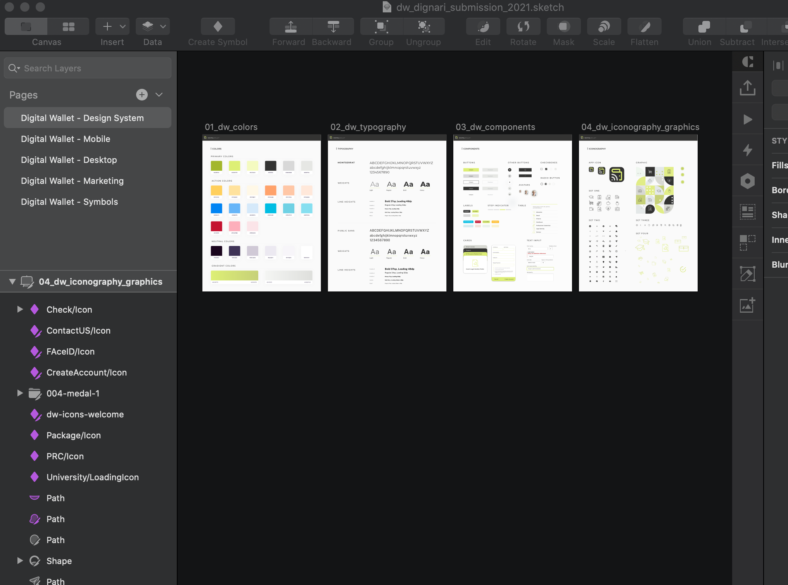
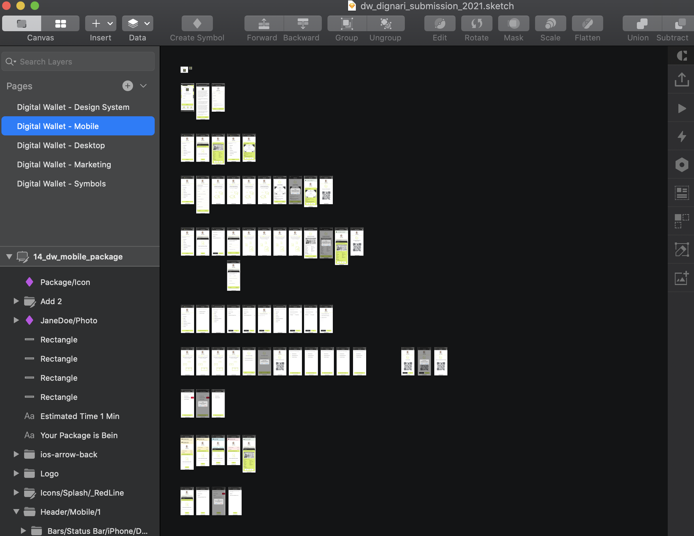
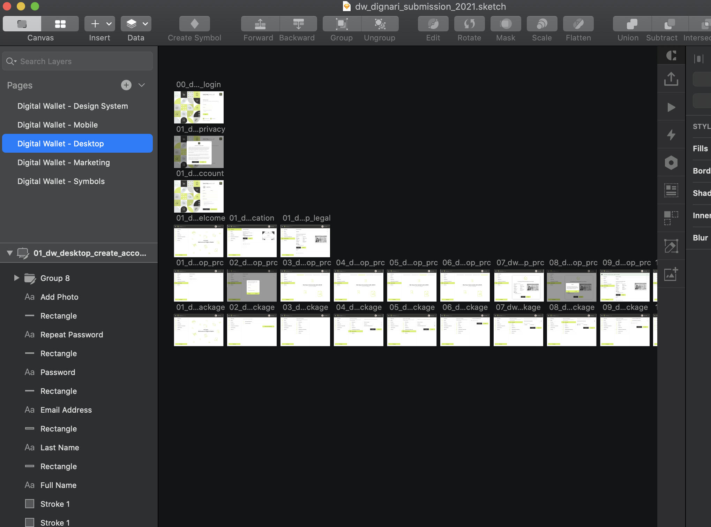
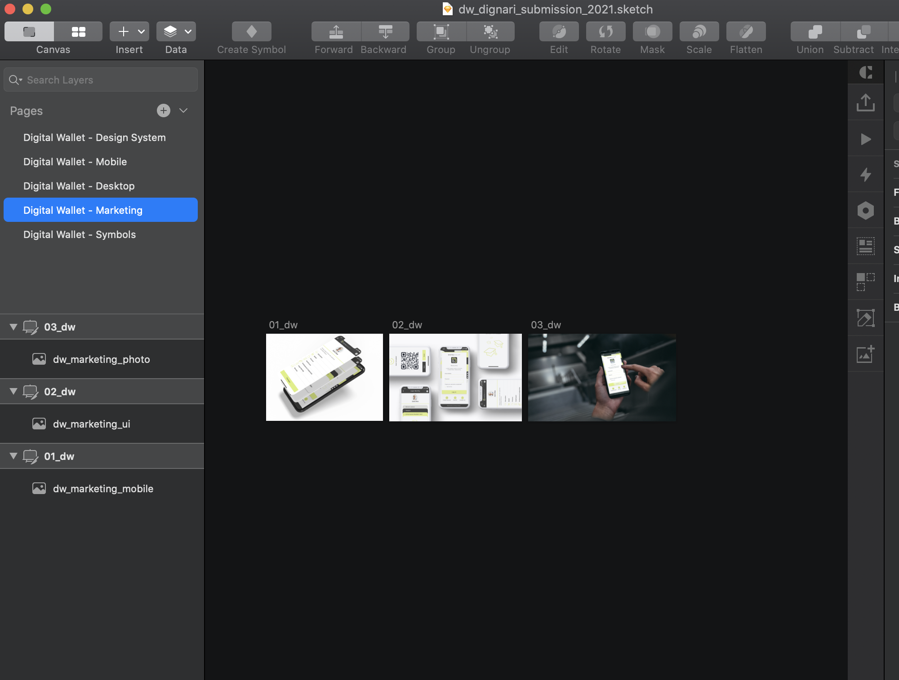
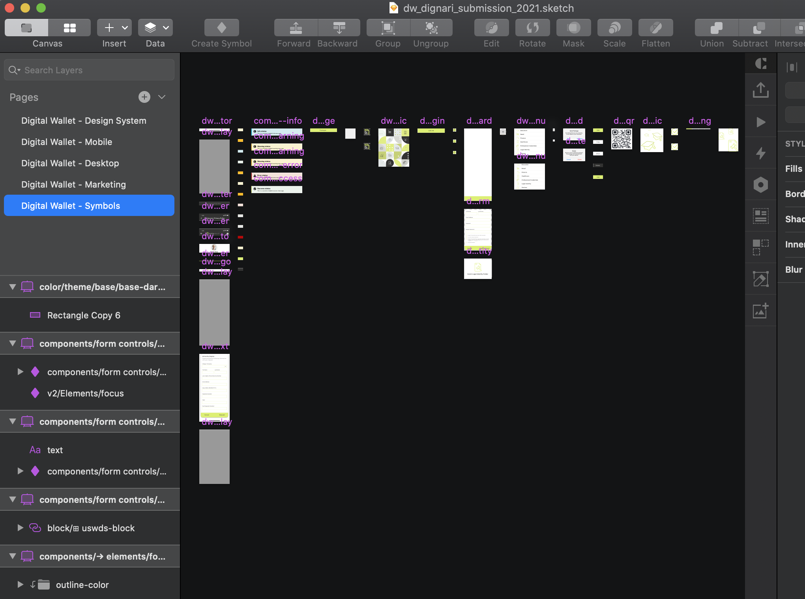
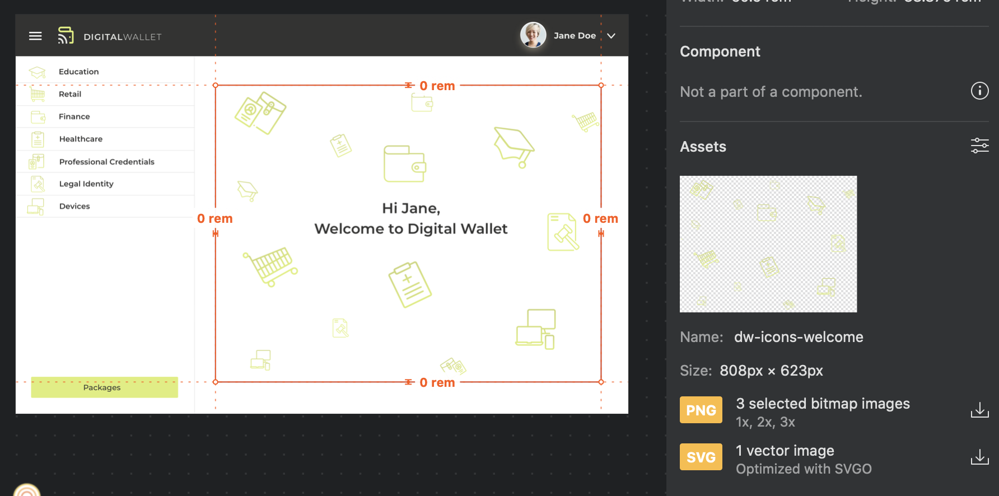
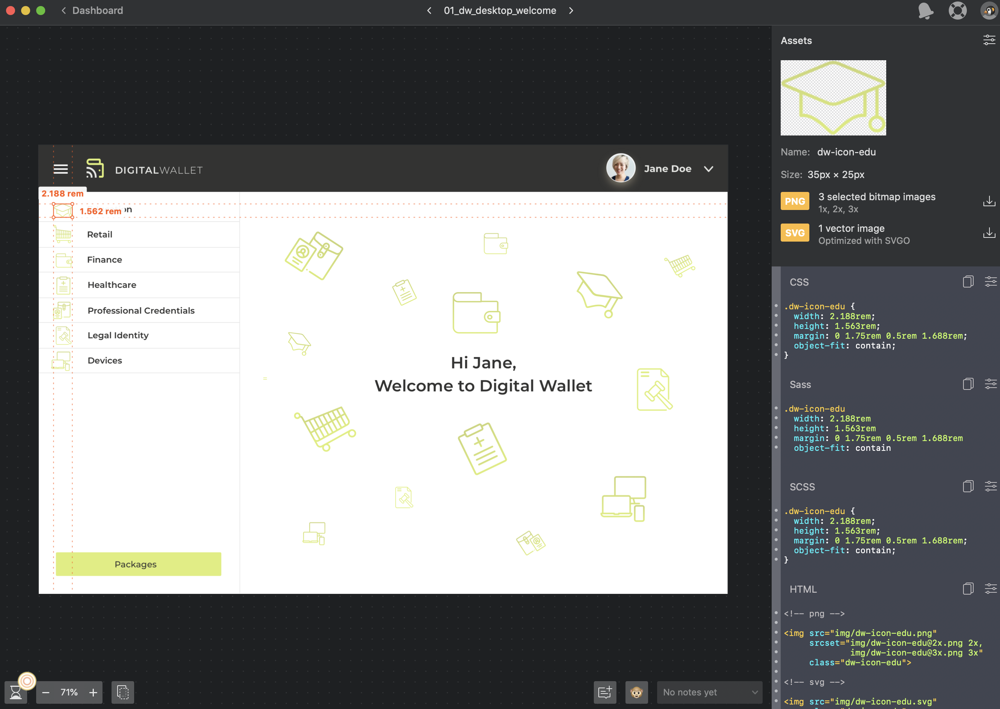
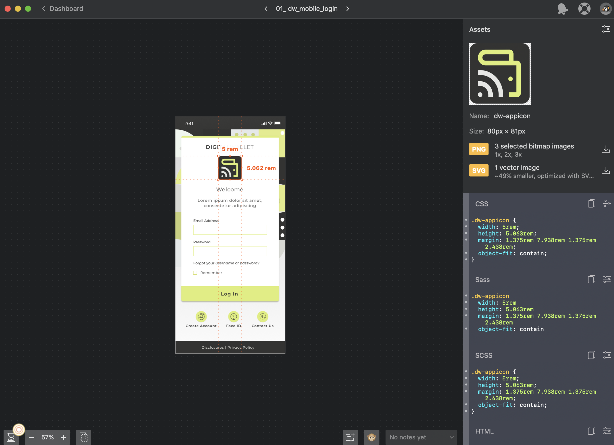

# Digital Wallet User Interface Design System

Welcome to the DHS Silicon Valley Innovation Program Digital Wallet UI Repo. Here you will find a number of artifacts for use in developing your own digital wallet solutions.

These design artifacts were developed as part of Dignari LLC's winning entry in the Department of Homeland Security (DHS) Science and Technology (S&T) 2020 <a href="https://www.dhs.gov/science-and-technology/news/2020/09/08/news-release-st-new-prize-competition-user-interface-digital" target="_blank">Trusted User Interface (UI) Digital Wallet Challenge</a>. This competition was a call for "...innovators to design an easy-to-use and trustworthy UI that improves the overall user experience (UX) and management of digital wallet-based credentials.”

You can learn more about the approach, design principles, and see Dignari's Stage 1 submission by visiting the <a href="https://www.dignari.com/digitalwallet" target="_blank">Dignari Digital Wallet Design System Site</a>.

## Design Artifacts

All of our design artifacts are published in the `dw-design-assets` folder. This includes color definitions, fonts, icons, screenprints, and Sketch design files.

### Sketch file

At the core of the design artifacts is the master Sketch file which contains 5 pages.

#### Page 1 - Digital Wallet - Design System

This page contains four Artboards: Colors, Typography, Various Components such as buttons, card styles and other as well as Iconography/Graphics.

#### Page 2 - Digital Wallet - Mobile Flows

This page contains nine mobile flows.

- Flow 1 covers login, privacy and disclosures, account creation.
- Flow 2 covers general views of the app while logged, legal identity folder, US Permanent Resident Card view, University Credential view.
- Flow 3 covers Education Credential retrieval.
- Flow 4 covers U.S. Permanent Resident Card retrieval.
- Flow 5 and 6 cover the creation of a Package, which included adding Education Credentials as well as U.S. Permanent Resident Card to a package and preparing to share the page with a QR code generation.
- Flow 7 covers the transaction history view as well as Deletion of a package no longer needed.
- Flow 8 cover various alerts: warning, information, error, success.
- Flow 9 covers deletion of documents from the legal documents folder.

#### Page 3 - Digital Wallet - Desktop Flows

This page contains four flows.

- Flow 1 covers login, privacy and disclosures, account creation.
- Flow 2 covers general views of the app while logged, legal identity folder, US Permanent Resident Card view, University Credential view.
- Flow 3 covers U.S. Permanent Resident Card retrieval.
- Flow 4 cover the creation of a Package, which included adding Education Credentials as well as U.S. Permanent Resident Card to a package and preparing to share the page with a QR code generation.

#### Page 4 - Digital Wallet - Marketing

This page contains 3 mockups with the Digital Wallet branding

#### Page 5 - Digital Wallet - Symbols

This page contains the symbols applied to all the screen.

## Developer Artifacts

### Zeplin 
Zeplin is a tool designed to help with design development, iteration, version control and collaboration. Zeplin can be used at multiple points in the project lifecycle. 

#### For stakeholders
We use it to provide a way for stakeholders to view the full collection of screens for understanding and review. You can visit our [public Zeplin instance](https://scene.zeplin.io/project/5fb41a91183b2377bdd3f4d0) to see the full collection of screens that have been designed for the digital wallet. This particular instance of Zeplin is read-only so some of the features discussed below will not be available. 

#### For developers
We also use Zeplin to aid in the handoff process between the designers and the developers. Once our Sketch screens have been uploaded to Zeplin, Zeplin automatically generates accurate specs, assets and code snippets, tailored for the platform used by the developers. Developers then access Zeplin under developer accounts where they can access all the specs, assets, code snippets, and style guides that have been generated. 

Developers can access the specific screens and the various elements within those screens. By simply clicking on the desired element, the developer is able to download the image files for icons, copy code snippets for stylesheets, and copy color scheme values for use in their development. This interface also provides measurements that the developer can use to render screens exactly as the designers intended.

#### Background Image Download

#### Measurements, Image Download, Stylesheet Code Snippets

# License
 
[MIT License](LICENSE)

Copyright (c) 2021 Dignari, LLC

digital-wallet-ui (the "Software") was developed and released through a 
Prize Competition held by the Science and Technology Directorate (S&T) 
of the U.S. Department of Homeland Security (DHS).

These software design artifacts were developed as part of Dignari LLC's
winning entry in the DHS S&T 2020 <a href="https://www.dhs.gov/science-and-technology/news/2020/09/08/news-release-st-new-prize-competition-user-interface-digital" target="_blank">Trusted User Interface (UI) Digital Wallet Prize Competition</a>. 
This competition was a call for "...innovators to design an easy-to-use and 
trustworthy UI that improves the overall user experience (UX) and management of 
digital wallet-based credentials” and therefore is subject to United States copyright
law. 

The United States Government has unlimited rights in the copyright in the Software
(See DHS-Dignari-Prize-License-Agreement.pdf), which is sufficient to allow end users 
to download, access, install, copy, modify, and otherwise use the Software for its intended purpose.

Specifically, the U.S. Government is providing the Software to Users with a 
royalty-free, irrevocable, worldwide license to use, disclose, reproduce, prepare 
derivative works, distribute copies to the public, including by electronic means, 
and perform publicly and display publicly the Software, in any manner, including by 
electronic means, and for any purpose whatsoever per the terms of the [MIT License](LICENSE).
